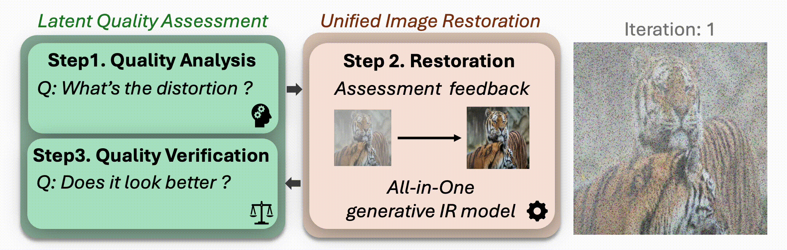

# ⚡️RAR (Restore, Assess, Repeat): A Unified Framework for Iterative Image Restoration

Official repository for Restore, Assess, Repeat: A Unified Framework for Iterative Image Restoration

[Project Page](https://restore-assess-repeat.github.io) | [Paper](https://arxiv.org/abs/2603.26385) | [Video](https://restore-assess-repeat.github.io) | [Code](https://github.com/SamsungLabs/RAR)

## Updates
- April 2026: ✨ Source code has been released!
- February 2026: ✨ RAR was accepted into CVPR 2026!

## RAR
**RAR** integrates -blue?style=flat-square) and -yellow?style=flat-square) within a shared latent space, enabling an iterative *Restore–Assess–Repeat* process for high-quality image restoration.



- **LQA** performs fine-grained quality assessment and degradation analysis directly in the latent space, providing adaptive feedback for restoration.  
- **UIR** leverages diffusion priors to perform unified image restoration, handling diverse and composite degradations in a single model.  

By tightly coupling assessment and restoration, RAR dynamically identifies degradations and refines outputs, achieving strong performance under unknown and composite degradations.

## Setup
1) Clone and enter into repo directory.
```
git clone https://github.com/SamsungLabs/RAR.git
cd RAR
```

2) Create a conda environment and activate it.
```
./environment_setup.sh rar
```

3) Download pretrained UniRestore checkpoints and place them into path (./checkpoints/).
- Quickly download all checkpoints from [Model_Zoo](https://huggingface.co/AaronCIH/RAR_modelzoo), or download individual checkpoints as needed.
```
cd checkpoints/
python download.py
```

- (option) Please update the configuration as follows:
    - configs/infer_cfg.yaml: 
        - `data.data_dir`  
        - `model.model_pretrained`  
        - `model.load_from`  
        - `vae.vae_pretrained`  
        - `text_encoder.text_encoder_pretrained` 
        - `connector.load_from` 
        - `sentence_model`

    - run.py
        - `RARInference.model_path`  
        - `RARInference.sentence_model`  

    - iqa/config.yaml
        - `model.vision_encoder_path`  
        - `model.tgt_vision_projector_weight`  
        - `model.llm_path`  
        - `model.delta_path`  
        - `model.checkpoints`

    - configs/sd35_imgflow_config/ir_sd35m_r512_multi.yaml (for training)
        - `data.data_dir`  
        - `model.model_pretrained`  
        - `model.load_from`  
        - `vae.vae_pretrained`  
        - `text_encoder.text_encoder_pretrained` 
        - `connector.load_from` 

## Run Demo (fast)
```
CUDA_VISIBLE_DEVICES=0 streamlit run run.py
```


📌 Open the provided URL in your browser and wait for the model to finish loading.<br>
📌 Click 'Upload' to use your own image or 'Select' a sample to begin the RAR process.<br>
📌 Move the 'progress bar' to compare intermediate outputs.<br>
💡 Feel free to use the samples provided in the /demo_sample directory.

## Prepare Dataset
We collect datasets for **single**, **unknown**, and **composite** degradations. Each dataset is organized in JSON format. Please download the datasets into the corresponding folders, and then use the following command to generate the data list:
```
cd dataset
python download.py
bash decomp_all.sh
python scripts/0_generate_list.py
python scripts/1_generate_iqa_brief.py
```
### Data Structures:
```
DATA_ROOT/PIR_tar/
    ├── $task_name/
    │   ├── $dataset/
    │   │   ├── image_folder/
    │   │   ├── metas/
```
DATA_ROOT is the path containing the counting datasets; Each `dataset/metas` should include: a `subset.list` specifying the image list and a `subset.json` containing the formatted metadata.

## Inference
- Find more details in `./scripts`, change "src_dir" in `./scripts/test_autocomparison.sh`
```
bash scripts/test_autocomparison.sh 0,1,2,3,4,5,6,7 configs/infer_cfg.yaml checkpoints/RAR_modelzoo/RAR/checkpoints/latest.pth output_composite/results/ 4 4 256 online d2c multi_c2c_d2c_online_compare_s4r4 bf16 
```

## Train
For faster reproduction, we recommend using the pre-trained LQA model and training the framework end-to-end. 
```
bash train_scripts_imgflow/train_imgflow_e2e_multi.sh \
8 \
output_imgflow/sd35m_multi_single_bf16 \
configs/sd35_imgflow_config/ir_sd35m_r512_multi.yaml \
--data.data_dir="[dataset/PIR_tar]" \
--data.type=IRImgDataset \
--model.multi_scale=false \
--train.train_batch_size=1 \
--train.gradient_accumulation_steps=16 \
--data.image_size=256 \
--model.image_size=256 \
--data.dset=train_brief \
--data.max_samples=null \
--model.load_from="./checkpoints/RAR_modelzoo/backbone/epoch_100_step_302601.pth" 
```

## Acknowledgements
This work builds upon the following open-source projects:
- Sana: Efficient High-Resolution Image Synthesis with Linear Diffusion Transformer, In ICLR 2025 Oral.
  \[[GitHub](https://github.com/NVlabs/Sana), [Paper](https://arxiv.org/abs/2410.10629)\]
- Stable Diffusion 3.5: Scaling Rectified Flow Transformers for High-Resolution Image Synthesis, In ICML 2024. 
  \[[GitHub](https://github.com/Stability-AI/sd3.5), [Paper](https://arxiv.org/abs/2403.03206)\]
- DepictQA: Depicted Image Quality Assessment with Vision Language Models, In ECCV 2024.
  \[[GitHub](https://depictqa.github.io/depictqa-v1/), [Paper](https://arxiv.org/abs/2312.08962)\]
  
We sincerely thank the authors for their open-source contributions.

# 📖BibTeX
```
@article{chen2026restore,
  title={Restore, Assess, Repeat: A Unified Framework for Iterative Image Restoration},
  author={Chen, I and Hadji, Isma and Sanchez, Enrique and Bulat, Adrian and Kuo, Sy-Yen and Timofte, Radu and Tzimiropoulos, Georgios and Martinez, Brais and others},
  journal={arXiv preprint arXiv:2603.26385},
  year={2026}
}
```
